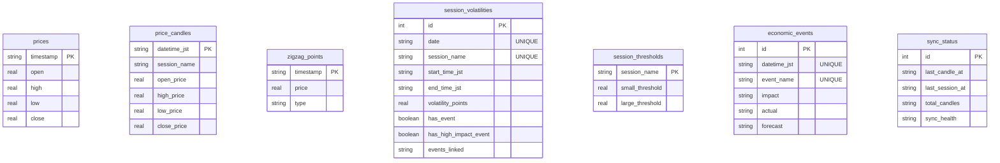

# Gold Volatility Analyzer (gold-bunseki-kun)

MT5(MetaTrader 5)から取得したGOLD(XAUUSD)の価格データと経済指標を組み合わせ、特定の時間帯（セッション）ごとのボラティリティを分析・可視化するフルスタックシステム。

## 🏗️ 構成とデータフロー (Data Flow)

システムは3つの独立したアプリケーションで構成される。

```mermaid
graph LR
    MT5[MT5 (Windows)] -->|CSV出力| Python[Analytics Engine (Python)]
    Python -->|HTTP POST| Hono[Backend API (Hono/PostgreSQL)]
    Hono -->|RPC / REST| Frontend[Frontend (Next.js/Vinext)]
```

### 1. Analytics Engine (`apps/analytics/`)
- **責務**: MT5データの監視、セッション分割（東京・ロンドン・NY等）、ボラティリティ計算、およびバックエンドへのデータPush。
- **実行**: ローカル（Windows）や専用VPSなどのPython環境。

### 2. Backend API (`apps/backend/`)
- **責務**: 分析データの永続化（PostgreSQL）、フロントエンド向けAPIの提供、同期処理の認証管理。
- **アーキテクチャ**: Clean Architecture (Domain, Application, Interface, Infrastructure)。
- **デプロイ**: GCP Compute Engine (Docker Compose) / Cloudflare D1等への拡張も対応設計。

### 3. Frontend (`apps/frontend/`)
- **責務**: 分析結果の可視化（Lightweight Charts、ボラティリティダッシュボード）。
- **デプロイ**: Cloudflare Workers (Vinextを用いた超低レイテンシ・エッジ配信)。

## 📊 データベース設計 (ER Diagram)

バックエンドの PostgreSQL は以下のスキーマで構成されています。



## 🛠️ 開発ガイドライン (Development)

開発や機能追加を行う際は、以下のルールを必ず遵守すること。

1. **Ground Truth (`GEMINI.md`)**: プロジェクトの憲法。技術スタックや品質基準（カバレッジ100%必須等）はここに従う。
2. **Architecture (`architecture.md`)**: 詳細なディレクトリ構造やレイヤーの責務を記載。
3. **ADR (`docs/adr/`)**: アーキテクチャ上の決定事項（スタック変更、通信方式の決定など）とその「理由」。迷った際はこの履歴を確認する。
4. **Lint & Test**: 全てのコード変更は `bun run lint:all` および `bun run test:all` をパスすること。

## 🚀 クイックスタート (Quick Start)

```bash
# インストール
bun install

# バックエンドとフロントエンドの開発サーバーを同時起動
make dev

# バックエンドのモック起動（DB接続不要）
make dev-mock
```
